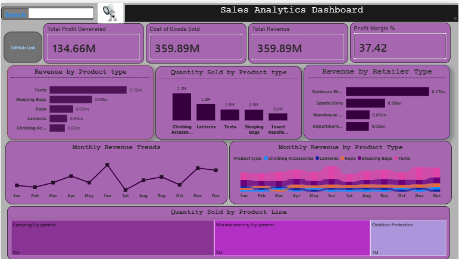

# 📊 Sales Performance Dashboard

## Project Overview

This project presents an interactive **Sales Performance Dashboard** developed in **Power BI** to analyze sales performance across products, retailers, and time. The dashboard provides insights into revenue, profit, profit margin, sales volume, and product performance, enabling stakeholders to identify key business trends and make informed decisions.

---

## Dashboard Preview

> 

---

## Business Objectives

The dashboard was designed to answer the following business questions:

* Which product types generate the highest revenue?
* Which products sell the highest quantity?
* Which retailer type contributes the most revenue?
* How does revenue change over time?
* Which product lines record the highest sales volume?
* What are the company's overall revenue, profit, and profit margin?

---

## Key Performance Indicators (KPIs)

| Metric            |       Value |
| ----------------- | ----------: |
| **Total Revenue** | **359.89M** |
| **Total Profit**  | **134.66M** |
| **Profit Margin** |  **37.42%** |

---

## Dashboard Visualizations

* KPI Cards
* Clustered Column Chart
* Line Chart
* Ribbon Chart
* Treemap

---

## Key Insights

* **Total Revenue** reached **359.89M**, generating a **Total Profit** of **134.66M** with an overall **Profit Margin of 37.42%**.
* **Tent** generated the highest revenue among all product types, making it the strongest revenue contributor.
* **Climbing Accessories** recorded the highest quantity sold, indicating that although it sells more units than other products, it generates less revenue than **Tent**, which ranks third in quantity sold.
* **Outdoor Shop** was the highest-performing retailer type, contributing the largest share of total revenue.
* Revenue showed noticeable peaks in **June** and **November**, while the remaining months exhibited fluctuating performance with alternating highs and lows.
* **Camping Equipment** was the best-performing product line in terms of total quantity sold.

---

## Tools & Technologies

* Microsoft Power BI
* Power Query
* DAX (Data Analysis Expressions)
* Microsoft Excel

---

## Skills Demonstrated

* Data Cleaning and Transformation
* Data Modeling
* DAX Measure Creation
* Interactive Dashboard Design
* Business Intelligence Reporting
* Data Visualization
* KPI Development
* Business Insight Generation

---

## Conclusion

This dashboard provides a comprehensive overview of sales performance by combining key performance indicators with interactive visualizations. It enables users to monitor business performance, identify top-performing products and retailers, analyze sales trends over time, and support data-driven decision-making.
