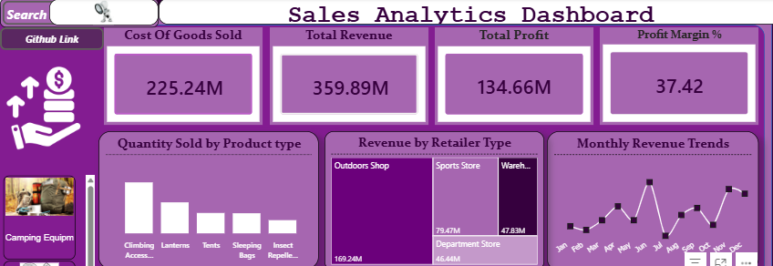

# 📊 Sales Performance Dashboard

## Project Overview

This project is an interactive **Sales Analytics Dashboard** developed in **Microsoft Power BI** to explore sales performance across products, product lines, retailer types, cities, and time.

The current dashboard focuses primarily on **revenue and sales-volume analysis**, while the underlying data model and DAX measures support further exploration of other business metrics, including profit.

The report was designed to encourage interactive exploration rather than simply present a fixed set of charts. Users can filter the dashboard by **product line using a Chiclet Slicer**, search for available insights, interact with visual elements through **Power BI Tooltips**, and access the project's GitHub repository directly from the report.

---

## 📸 Dashboard Preview

*Interactive Power BI dashboard showing revenue, quantity sold, product-line performance, retailer performance, and revenue trends.*

---

## 🚧 Project Status

**Work in Progress**

This is an ongoing sales analytics project.

The current dashboard focuses mainly on **revenue and sales-volume analysis**. I plan to expand the project with additional dashboards exploring areas such as **profit, cities, products, and retailer performance**.

The goal is to build a broader analytical report where each dashboard answers a different set of business questions while using the same underlying data model.

---

## 🎯 Business Objectives

The dashboard was developed to explore questions such as:

* Which products generate the highest revenue?
* Which products have the highest quantity sold?
* Does the product with the highest sales volume also generate the highest revenue?
* Which product lines contribute the most to sales?
* Which retailer types generate the most revenue?
* How does revenue change over time?
* How can interactive filtering be used to explore sales performance from different perspectives?
* What are the company's overall revenue, profit, and profit margin?

---

## 🔎 Dashboard Features

### 🎛️ Interactive Product Line Filter

A **Chiclet Slicer** was implemented to allow users to filter the dashboard by product line.

Selecting a product line dynamically updates the dashboard visuals, making it easier to examine the performance of individual product lines and understand how they contribute to overall sales.

### 🔍 Search & Interactive Exploration

The dashboard includes a **search feature** that allows users to explore insights beyond the visuals initially displayed on the page.

For example, a user can search for an insight such as:

> **"Top retailer cities by total profit"**

Where the required data and DAX measure are available, the relevant visual can be displayed for further exploration.

This allows users to investigate questions based on the available data instead of being restricted to only the charts initially placed on the dashboard.

### 💡 Power BI Tooltips

**Tooltips** were incorporated into the dashboard to provide additional information when users interact with visual elements.

This allows more context to be presented without overcrowding the main dashboard with additional labels and visuals.

### 🔗 GitHub Integration

A **GitHub button** is embedded within the dashboard, allowing users to access the project's repository directly from the report.

This provides a connection between the interactive dashboard and its supporting project documentation and source files.

---

## 📈 Key Performance Indicators

| Metric                  |           Value |
| ----------------------- | --------------: |
| **Total Revenue**       |     **359.89M** |
| **Total Profit**        |     **134.66M** |
| **Profit Margin**       |      **37.42%** |
| **Total Quantity Sold** | **6.58M units** |

These KPIs provide a high-level view of the company's sales and financial performance within the dataset.

---

## 📊 Dashboard Visualizations

The current dashboard includes:

* KPI Cards
* Clustered Column Chart
* Clustered Bar Chart
* Line Chart
* Ribbon Chart
* Treemap
* Chiclet Slicer
* Power BI Tooltips
* Search functionality
* GitHub navigation button

---

## 💡 Key Insights

### 1. Revenue and Profit Performance

The analysis recorded approximately **359.89M in total revenue**, with **134.66M in total profit**, resulting in an overall **profit margin of 37.42%**.

These KPIs provide a high-level view of the company's financial performance within the dataset.

### 2. Revenue vs. Quantity Sold

One of the key observations from the analysis is that **the product with the highest quantity sold is not the product generating the highest revenue**.

**Climbing Accessories** recorded the highest quantity sold at approximately **2.19M units**.

However, **Tents** generated the highest revenue at approximately **154.43M**, despite selling approximately **875K units**.

This highlights an important distinction between **sales volume and revenue**. A product can sell significantly more units without necessarily becoming the largest contributor to revenue.

### 3. Product Line Performance

**Camping Equipment** recorded the highest quantity sold among the product lines, with approximately **3.07M units**, while also generating approximately **274.75M in revenue**.

| Product Line             | Quantity Sold |     Revenue |
| ------------------------ | ------------: | ----------: |
| **Camping Equipment**    |     **3.07M** | **274.75M** |
| Mountaineering Equipment |         2.36M |      77.64M |
| Outdoor Protection       |         1.15M |       7.51M |

### 4. Retailer Type Performance

**Outdoors Shop** generated the highest revenue among the retailer types, contributing approximately **169.24M**.

| Retailer Type          |     Revenue |
| ---------------------- | ----------: |
| **Outdoors Shop**      | **169.24M** |
| Sports Store           |      79.47M |
| Warehouse Store        |      47.83M |
| Department Store       |      46.44M |
| Direct Marketing       |       8.70M |
| Equipment Rental Store |       8.21M |

### 5. Revenue Trend Over Time

Revenue fluctuated throughout the year, with noticeable peaks in **June** and **November**.

June recorded approximately **36.19M** in revenue, while November recorded approximately **34.78M**.

The monthly variation provides an opportunity to investigate potential seasonal patterns and understand which products, product lines, retailer types, or locations contribute to changes in revenue.

---

## 💼 Business Recommendations

The current findings suggest several areas that could be investigated further:

### 1. Investigate the Revenue–Volume Relationship

Since **Climbing Accessories** has the highest sales volume while **Tents** generate the highest revenue, further analysis could examine the factors behind this difference, including **product pricing, product mix, and profit contribution**.

This can help distinguish products that primarily drive **volume** from those that drive **revenue value**.

### 2. Examine High-Revenue Products

Products such as **Tents**, which generate substantial revenue despite having lower unit volume than Climbing Accessories, could be examined further to understand their pricing, profitability, demand patterns, and contribution to overall business performance.

### 3. Analyse Camping Equipment Further

Camping Equipment contributes the largest quantity sold and the largest revenue among the product lines in the current dataset.

A deeper analysis could examine which individual products within this product line are responsible for the strongest performance and whether their performance is consistent across different retailers and cities.

### 4. Investigate Retailer Type Performance

Since **Outdoors Shop** generates the highest revenue among retailer types, further analysis could examine the products and cities associated with this performance.

This could help determine whether the revenue is concentrated in a small number of locations or distributed across multiple markets.

### 5. Investigate Revenue Peaks

The noticeable revenue peaks in **June and November** could be investigated further by breaking revenue down by:

* Product
* Product line
* Retailer type
* Retailer city
* Quantity sold
* Profit

This could help determine whether the peaks are associated with increased sales volume, particular products, specific locations, or a combination of factors.

---

## 🛠️ Tools & Technologies

* **Microsoft Power BI**
* **Power Query**
* **DAX (Data Analysis Expressions)**
* **Microsoft Excel**

---

## 🧠 Skills Demonstrated

* Data Cleaning and Transformation
* Data Modeling
* DAX Measure Creation
* KPI Development
* **Power BI Tooltips**
* Interactive Dashboard Design
* Data Visualization
* Business Intelligence Reporting
* Business Insight Generation
* Power BI Slicer Configuration
* Search and Interactive Exploration
* Report Navigation
* Data Storytelling

---

## 📂 Dataset

The project uses sales transaction and product data containing information such as:

* Date
* Retailer City
* Retailer Type
* Product Code
* Product
* Product Line
* Product Type
* Sale Price
* Product Cost
* Quantity Sold
* Order Method
* Sales Status

The dataset contains **7,520 sales records** and information covering **51 products**.

---

## 🚀 Future Development

This project is currently **a work in progress**.

The current dashboard provides a revenue-focused view of sales performance. Rather than placing every possible analysis on one page, the project will be expanded into additional dashboards that explore different dimensions of the dataset.

### 📍 City Analysis

A dedicated dashboard will explore sales performance across retailer cities to identify geographical patterns and differences in performance.

### 💰 Profit Analysis

A dedicated profit-focused dashboard will provide deeper analysis of **profit and profit margin**, complementing the current revenue-focused view.

### 🛍️ Product Analysis

Further analysis will explore individual products, product types, quantity sold, revenue, and profitability.

### 🏪 Retailer Analysis

Additional analysis will explore retailer performance across cities, product lines, revenue, quantity, and profit.

The broader goal is to develop a connected **Sales Analytics Report** where each dashboard answers a different set of business questions while using the same underlying data model.

---

## 🎯 Conclusion

This project demonstrates how **Power BI can be used to transform raw sales data into an interactive analytical tool**.

The current dashboard provides a revenue-focused view of sales performance while highlighting an important relationship between **sales volume and revenue contribution**. The interactive Chiclet Slicer, search functionality, Power BI Tooltips, and GitHub integration make the report more exploratory and user-friendly.

The analysis also demonstrates that the product selling the highest number of units does not necessarily generate the highest revenue, creating opportunities for deeper investigation into **pricing, product mix, profitability, retailer performance, and geographical trends**.

As the project continues to develop, additional dashboards will extend the analysis into **profit, cities, products, retailers, and other dimensions of sales performance**.

The objective is not simply to present charts, but to use data to ask better business questions, uncover relationships within the data, and communicate findings in a way that supports informed decision-making.
