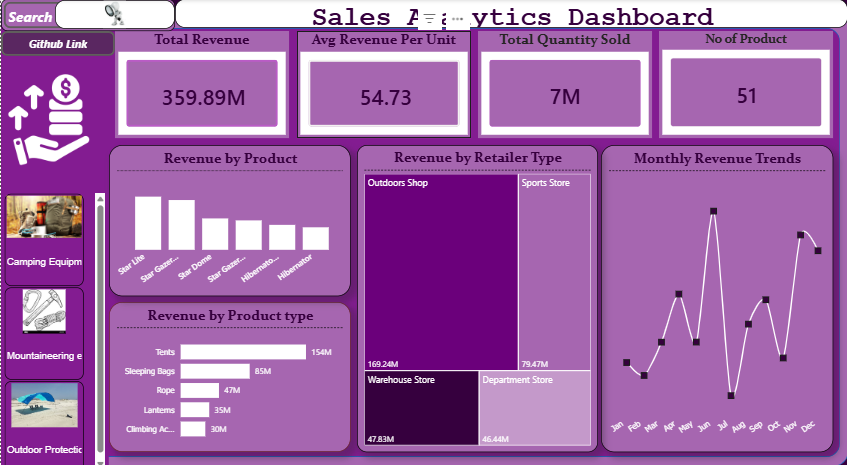
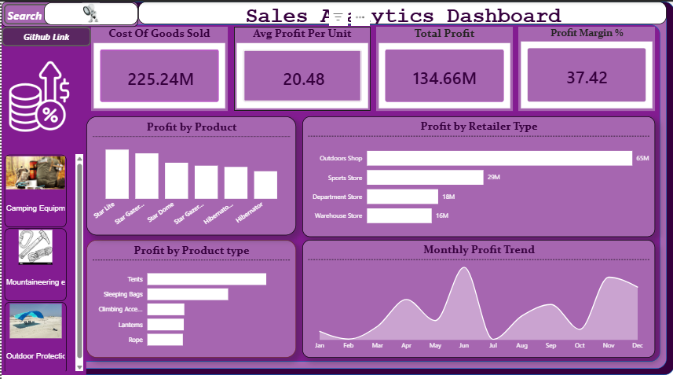

# 📊 Sales Analytics Dashboard

## Project Overview

This project is an interactive **Sales Analytics Dashboard** developed in **Microsoft Power BI** to explore sales performance across products, product lines, retailer types, cities, and time.

The project has evolved from an initial revenue-focused dashboard into a broader **Sales Analytics Report**, with dedicated views for **Revenue Analysis** and **Profitability Analysis**.

The dashboards are built on the same underlying data model and use DAX measures to support interactive exploration of different business questions.

The report also incorporates interactive features including a **Chiclet Slicer**, **Power BI Tooltips**, a **search feature**, and **GitHub navigation**, allowing users to explore the data beyond the predefined visuals.

> 🚧 **Project Status: Work in Progress**
>
> The Revenue and Profitability dashboards are currently completed. A dedicated **Home/Navigation page** is being developed, with additional dashboards planned for areas such as city, product, and retailer analysis.

---

## 📸 Dashboard Preview

### Revenue Analysis

<!-- Add Revenue Dashboard screenshot here -->

*Revenue-focused dashboard analysing sales trends, product performance, product lines, and retailer types.*

---

### Profitability Analysis

<!-- Add Profitability Dashboard screenshot here -->

*Profitability dashboard analysing profit, profit margin, cost of goods sold, product profitability, retailer performance, and monthly profit trends.*

---

# 🎯 Project Objectives

The project was developed to explore key business questions around sales and profitability, including:

- Which products generate the highest revenue?
- Which products have the highest quantity sold?
- Does the product with the highest sales volume also generate the highest revenue?
- Which product lines contribute the most to sales and profit?
- Which retailer types generate the most revenue and profit?
- Which products generate the highest and lowest profit?
- Which products have the strongest profit margins?
- How does revenue change over time?
- How does profit change over time?
- Which cities contribute the most to profitability?
- How can interactive features be used to explore different business questions?

---

# 📑 Dashboard Structure

The project currently contains two completed analytical views.

## 1. Revenue Analysis

**Business question:**

> *Where is the revenue coming from?*

The Revenue dashboard focuses on understanding the company's revenue performance across products, product lines, retailer types, and time.

Key areas explored include:

- Total Revenue
- Quantity Sold
- Revenue by Product
- Revenue by Product Line
- Revenue by Retailer Type
- Revenue trends over time
- Product-line filtering

---

## 2. Profitability Analysis

**Business question:**

> *Where is the profit coming from, and what is driving profitability?*

The Profitability dashboard extends the analysis beyond revenue by examining:

- Cost of Goods Sold
- Average Profit per Unit
- Total Profit
- Profit Margin
- Profit by Product
- Profit by Product Type
- Profit by Retailer Type
- Monthly Profit Trend

This allows the analysis to move from simply understanding **how much revenue is generated** to examining **how much value is retained as profit**.

---

# 🔎 Interactive Dashboard Features

## 🎛️ Chiclet Slicer

A **Chiclet Slicer** was implemented to allow users to filter the dashboard by product line.

Selecting a product line dynamically updates the relevant visuals, allowing users to explore the performance of individual product lines.

---

## 🔍 Search & Interactive Exploration

The dashboard includes a **search feature** that allows users to explore insights beyond the visuals initially displayed on the page.

For example, users can search for an insight such as:

> **"Top retailer cities by total profit"**

Where the required data and DAX measure are available, the relevant visual can be displayed for further exploration.

This allows the report to support exploratory analysis rather than restricting users to only the charts initially placed on the dashboard.

---

## 💡 Power BI Tooltips

**Power BI Tooltips** were incorporated to provide additional information when users interact with visual elements.

This allows additional context to be displayed without overcrowding the main dashboard.

---

## 🔗 GitHub Integration

A **GitHub button** is embedded within the dashboards, allowing users to access the project's repository directly from the report.

This connects the interactive Power BI report with its supporting documentation and project files.

---

# 📈 Key Performance Indicators

The overall dataset currently produces the following key performance indicators:

| Metric | Value |
|---|---:|
| **Total Revenue** | **359.89M** |
| **Total Profit** | **134.66M** |
| **Profit Margin** | **37.42%** |
| **Cost of Goods Sold** | **225.24M** |
| **Average Profit per Unit** | **20.48** |
| **Total Quantity Sold** | **6.58M units** |

These KPIs provide a high-level view of the company's sales and profitability performance within the dataset.

---

# 💡 Key Insights

## Revenue Analysis

### 1. Revenue vs. Quantity Sold

One of the key observations from the Revenue Analysis is that **the product with the highest quantity sold is not necessarily the product generating the highest revenue**.

**Climbing Accessories** recorded the highest quantity sold at approximately **2.19M units**.

However, **Tents** generated the highest revenue at approximately **154.43M**, despite selling approximately **875K units**.

This highlights an important distinction between **sales volume and revenue contribution**.

A product can sell significantly more units without necessarily becoming the largest contributor to revenue.

---

### 2. Product Line Performance

**Camping Equipment** recorded the highest quantity sold among the product lines, with approximately **3.07M units**, while also generating approximately **274.75M in revenue**.

| Product Line | Quantity Sold | Revenue |
|---|---:|---:|
| **Camping Equipment** | **3.07M** | **274.75M** |
| Mountaineering Equipment | 2.36M | 77.64M |
| Outdoor Protection | 1.15M | 7.51M |

---

### 3. Retailer Type Performance

**Outdoors Shop** generated the highest revenue among the retailer types, contributing approximately **169.24M**.

| Retailer Type | Revenue |
|---|---:|
| **Outdoors Shop** | **169.24M** |
| Sports Store | 79.47M |
| Warehouse Store | 47.83M |
| Department Store | 46.44M |
| Direct Marketing | 8.70M |
| Equipment Rental Store | 8.21M |

---

### 4. Revenue Trend

Revenue fluctuated throughout the year, with noticeable peaks in **June** and **November**.

June recorded approximately **36.19M** in revenue, while November recorded approximately **34.78M**.

These fluctuations provide opportunities for further investigation into the products, product lines, retailer types, and locations contributing to changes in revenue.

---

# 💰 Profitability Analysis Insights

## 1. Overall Profitability

The dataset generated approximately **134.66M in total profit** with an overall **profit margin of 37.42%**.

The Profitability dashboard also shows approximately **225.24M in Cost of Goods Sold** and an **Average Profit per Unit of 20.48**.

Together, these measures provide a broader view of the relationship between sales revenue, costs, and profitability.

---

## 2. Most Profitable Product

**Starlite** recorded the highest profit among the products analysed.

This provides an opportunity to investigate what factors contribute to its profitability, including its selling price, product cost, sales volume, and profit margin.

---

## 3. Lowest-Profit Product

**Calamine Relief** recorded the lowest profit among the products analysed.

This creates an opportunity for further investigation into whether its lower profitability is associated with sales volume, pricing, product cost, or other factors.

---

## 4. Product Line Profitability

**Camping Equipment** recorded the highest profit among the product lines.

This is consistent with its strong performance in the Revenue Analysis, where it also recorded the highest quantity sold and revenue.

Further analysis can explore which individual products within Camping Equipment contribute most strongly to its profitability.

---

## 5. Retailer Type Profitability

**Outdoors Shop** recorded the highest profit among the retailer types.

This provides an opportunity to investigate the products and locations contributing to the retailer type's strong profitability.

---

## 6. City Profitability

**Basel, Switzerland** recorded the highest profit among the retailer cities analysed.

This creates an opportunity for a more detailed geographical analysis to understand which products, product lines, and retailer types contribute to profitability in Basel.

---

## 7. Monthly Profit Trend

Profit fluctuates throughout the year, with noticeable changes across the months and a prominent peak around **June**.

Further analysis can be used to investigate whether these changes are driven by particular products, product lines, retailer types, or locations.

---

# 💼 Business Recommendations

The current analysis suggests several areas that could be investigated further.

## 1. Distinguish Volume Drivers from Value Drivers

The difference between **Climbing Accessories**, which records the highest quantity sold, and **Tents**, which generates the highest revenue, demonstrates that sales volume and revenue contribution should not be viewed as the same measure.

Further analysis of pricing, product mix, and profitability can help identify products that primarily drive **volume** versus those that drive **financial value**.

---

## 2. Investigate Highly Profitable Products

Products such as **Starlite**, which records the highest profit, could be examined further to understand the factors contributing to its profitability.

This could include analysing:

- Sales volume
- Selling price
- Product cost
- Profit margin
- Retailer type
- Geographic performance

---

## 3. Review Low-Profit Products

Products such as **Calamine Relief**, which records the lowest profit, could be investigated to understand the factors contributing to its lower profitability.

This does not necessarily mean the product should be discontinued. Instead, further analysis of its cost, price, volume, and margin could help determine what is influencing its performance.

---

## 4. Examine Camping Equipment

Camping Equipment performs strongly across the current analysis, recording the highest quantity sold, revenue, and profit among the product lines.

A deeper analysis could identify the individual products responsible for this performance and examine whether their performance is consistent across different retailers and cities.

---

## 5. Investigate High-Performing Retailer Types

Since **Outdoors Shop** records the highest revenue and profit among retailer types, further analysis could examine the products and cities associated with this performance.

This could help determine whether the performance is concentrated in specific locations or spread across multiple markets.

---

## 6. Explore High-Performing Cities

Since **Basel, Switzerland** records the highest profit among retailer cities, a dedicated geographical analysis could examine:

- Revenue by city
- Profit by city
- Profit margin by city
- Quantity sold by city
- Product performance by city
- Retailer performance by city

This would provide greater context around geographical performance.

---

# 📊 Dashboard Visualizations

The project currently includes a combination of:

- KPI Cards
- Clustered Column Charts
- Clustered Bar Charts
- Line Charts
- Ribbon Charts
- Treemaps
- Chiclet Slicer
- Power BI Tooltips
- Search functionality
- GitHub navigation button

The exact visuals vary between the Revenue and Profitability dashboards according to the business questions being analysed.

---

# 🛠️ Tools & Technologies

- **Microsoft Power BI**
- **Power Query**
- **DAX (Data Analysis Expressions)**
- **Microsoft Excel**

---

# 🧠 Skills Demonstrated

- Data Cleaning and Transformation
- Data Modeling
- DAX Measure Creation
- KPI Development
- Power BI Tooltips
- Interactive Dashboard Design
- Data Visualization
- Business Intelligence Reporting
- Business Insight Generation
- Power BI Slicer Configuration
- Search and Interactive Exploration
- Report Navigation
- Data Storytelling
- Revenue Analysis
- Profitability Analysis

---

# 📂 Dataset

The project uses sales transaction and product data containing information such as:

- Date
- Retailer City
- Retailer Type
- Product Code
- Product
- Product Line
- Product Type
- Sale Price
- Product Cost
- Quantity Sold
- Order Method
- Sales Status

The dataset contains **7,520 sales records** and information covering **51 products**.

---

# 🚧 Project Status & Future Development

This project is currently **a work in progress**.

### Current Progress

| Status | Analysis |
|---|---|
| ✅ Completed | Revenue Analysis |
| ✅ Completed | Profitability Analysis |
| 🚧 In Progress | Home / Navigation Page |
| 🔜 Planned | City Analysis |
| 🔜 Planned | Product Analysis |
| 🔜 Planned | Retailer Analysis |

---

## 🏠 Home / Navigation Page

A dedicated **Home/Navigation page** is currently being developed to serve as the entry point to the report.

The page will provide users with an overview of the available analyses and allow them to navigate between the different dashboards.

Planned navigation will include areas such as:

- Revenue Analysis
- Profitability Analysis
- City Analysis
- Product Analysis
- Retailer Analysis

---

## 📍 City Analysis

A dedicated dashboard will explore geographical performance across retailer cities.

Potential areas of analysis include:

- Revenue by city
- Profit by city
- Profit margin by city
- Quantity sold by city
- Product performance by city
- Retailer performance by city

---

## 🛍️ Product Analysis

Further analysis will explore individual products and product types across:

- Quantity sold
- Revenue
- Profit
- Profit margin
- Product cost
- Sales trends

---

## 🏪 Retailer Analysis

Additional analysis will explore retailer performance across:

- Revenue
- Profit
- Profit margin
- Quantity sold
- Product lines
- Cities

---

The broader goal is to develop a connected **Sales Analytics Report** where each dashboard answers a different set of business questions while using the same underlying data model.

---

# 🎯 Conclusion

This project demonstrates how **Power BI can be used to transform raw sales data into an interactive analytical report**.

The project has progressed from an initial revenue-focused dashboard into a broader analysis that now includes both **Revenue Analysis and Profitability Analysis**.

The Revenue dashboard highlights where sales revenue is coming from, while the Profitability dashboard extends the analysis by examining costs, profit, profit margins, products, retailer types, cities, and monthly profitability trends.

The interactive **Chiclet Slicer, Power BI Tooltips, search functionality, and GitHub integration** make the report more exploratory and allow users to investigate different questions using the underlying data.

The project remains a **work in progress**, with a Home/Navigation page currently being developed and additional dashboards planned for city, product, and retailer analysis.

The objective is not simply to present charts, but to use data to **ask better business questions, uncover relationships within the data, and communicate insights in a way that supports informed decision-making.**